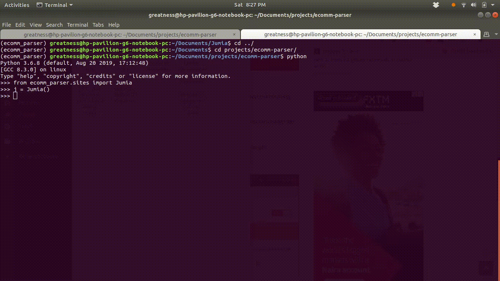

# ecomm-parser

[](https://www.python.org/downloads/release/python-360/)

A simple program that scrapes for items and their prices, discounts on ecommmerce sites

- [Ecommerce Parser](#ecomm-parser)
    - [Supported Sites](#supported-sites)
    - [Usage](#usage)
    - [Development](#development)
    - [Contributing](#contributing)
    - [Acknowledgement](#acknowledgment)

## Supported Sites
- Jumia

## Usage
```
python
from ecomm_parser.sites import Jumia
j = Jumia()

j.search('https://www.jumia.com.ng/keyboards-mice-accessories')

# to search for items with discount

j.search_get_discount('https://www.jumia.com.ng/keyboards-mice-accessories',discount=-85, start_num = 13, end_num=19)
```
### Demo




## Development

Clone the repository

```bash
    git clone https://github.com/Iamdavidonuh/ecomm-parser.git
```

Create virtual environment and install requirements

```bash
    mkvirtualenv ecomm_parser
    pip install -r requirements.txt
```

## Contributing
Pull requests are welcome. For major changes, please open an issue first.

## Acknowledgement
- Thanks goes out to <a href="https://github.com/MeNsaaH"><b>Mmadu Manasseh</b></a> for the success of this project
 